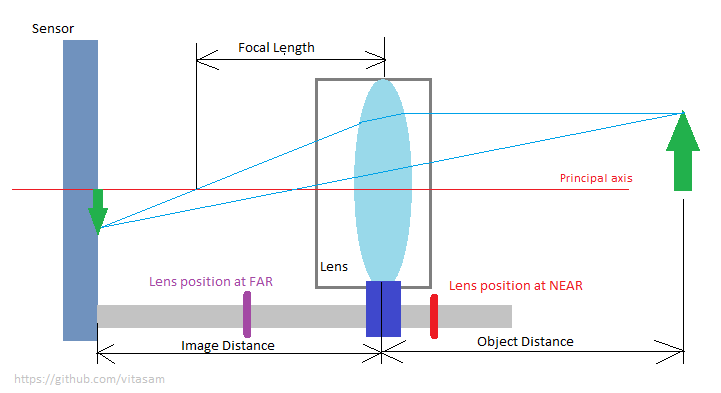
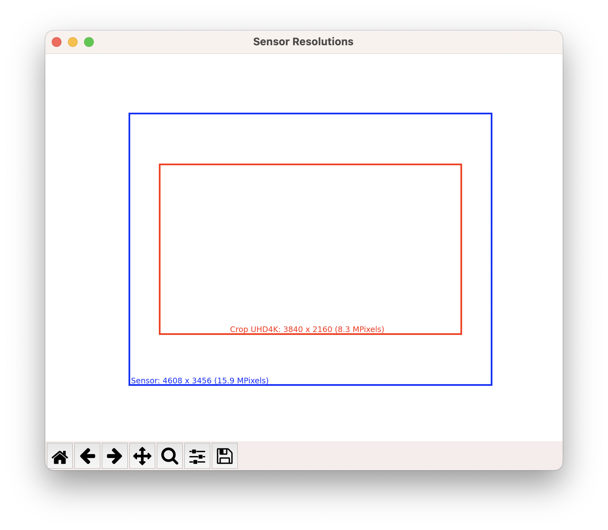
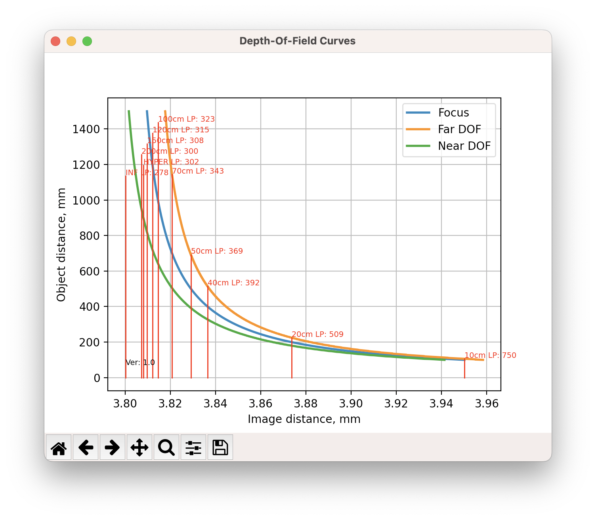

# Camera Calculator

Camera Calculator is a simple tool for optics and imaging sensor visualizations concerning resolutions, cropping, lens focusing, and Depth-Of-Field.

## Object Distance and Image Distance
* The *object distance* is the distance of the object to the centre line of the lens.
* The *image distance* (sometimes confused with the *focal length*) is the distance of the image to the centre line of the lens.

Below is a simplified camera module schematics:


## Disclaimer
*Camera Calculator uses [thin lens](https://en.wikipedia.org/wiki/Thin_lens) equiations, with approximations that ignore optical effects due to the thickness of lenses. Therefore, this calculator cannot be used for accurate calculations of optics and focus in cameras.*

## Camera Calculator Command Line Interface
```bash
python .\cameracalc.py -h
```

```bash
-h, --help            show this help message and exit
  -r {HD720,HD1080,3M,4M,5M,6M,8M,UHD4K,12M,16M,20M,48M}, --resolution {HD720,HD1080,3M,4M,5M,6M,8M,UHD4K,12M,16M,20M,48M}
                        resolution name of imaging sensor format
  -s {1/3.6,1/3.2,1/3,1/2.9,1/2.7,1/2.5,1/2.4,1/2.3,1/2,1/1.8,2/3,1,M4/3,APS-C,FULL}, --size {1/3.6,1/3.2,1/3,1/2.9,1/2.7,1/2.5,1/2.4,1/2.3,1/2,1/1.8,2/3,1,M4/3,APS-C,FULL}
                        diagonal size of the imaging sensor
  -l FOCAL_LENGTH, --focal_length FOCAL_LENGTH
                        camera focal length, mm
  -a APERTURE, --aperture APERTURE
                        lens aperture, F-number
  -o OBJECT_DISTANCE, --object_distance OBJECT_DISTANCE
                        maximum object distance for "Lens DOF figure", mm
  -c {HD720,HD1080,3M,4M,5M,6M,8M,UHD4K,12M,16M,20M,48M}, --crop {HD720,HD1080,3M,4M,5M,6M,8M,UHD4K,12M,16M,20M,48M}
                        target crop from native sensor resolution
  -f FAR_LENS, --far_lens FAR_LENS
                        lens position value at FAR
  -n NEAR_LENS, --near_lens NEAR_LENS
                        lens position value at NEAR
  -m MACRO_DISTANCE, --macro_distance MACRO_DISTANCE
                        object distance, corresponding to NEAR
  -i INF_DISTANCE, --inf_distance INF_DISTANCE
                        object distance, corresponding to FAR
  --min_f_dist MIN_F_DIST
                        minimum focusing distance, lens can focus (default=100), mm
  --max_od_dof MAX_OD_DOF
                        maximum object distance limit for "Lens DOF" plot (default=1500), mm
```

## Example of calculations

Let's calculate camera module parameters with the following data:
* Sensor resolution: 16 Megapixels
* Sensor size: 1/2.3"
* Focal length: 3.8 mm
* Lens aperture: F2.4
* Target crop of the camera pipeline: UHD 4K
* Lens position value at FAR (when camera is focused to far distance): 300
* Lens position value at NEAR (when camera is focused to close distance): 750
* Object distance, corresponding to FAR lens position: 2500 mm
* Object distance, corresponding to NEAR lens position: 100 mm

```bash
python cameracalc.py -r 16M -s 1/2.3 -l 3.8 -a 2.4 -c UHD4K -f 300 -n 750 -m 100 -i 2500
```



```bash
..> python cameracalc.py -r 16M -s 1/2.3 -l 3.8 -a 2.4 -c UHD4K -f 300 -n 750 -m 100 -i 2500
Camera Calculator, ver 1.0

===== Parameters =====
Minimum focusing distance: 100 mm
Maximum object distance limit for DOF plot: 1500 mm
Image resolution: 16M, (4608, 3456) pixels
Sensor diagonal size: 1/2.3, (6.16, 4.62) mm
Focal length: 3.8 mm
Lens aperture (F-number): 2.4
Target crop: UHD4K, (3840, 2160) pixels
Lens position value at FAR: 300
Lens position value at NEAR: 750
Object distance at FAR: 2500 mm
Object distance at NEAR: 100 mm

===== Calculations =====
Sampling frequency: 748.1 pixels/mm
Pixel pitch: 1.34 um
Nyquist limit: 299.22 lp/mm (kell factor: 0.8)
Focal length in 35-mm equivalent: 21.4 mm
Circle of confusion: 0.0033 mm
UHD4K horizontal crop factor: 1.20
UHD4K vertical crop factor: 1.60
UHD4K cropped sensor width: 5.13 mm
UHD4K cropped sensor height: 2.89 mm
UHD4K cropped sensor diagonal: 5.89 mm
UHD4K focal length in 35-mm equivalent: 27.9 mm
Horizontal Angle-Of-View (effective): 78.1 deg
Vertical Angle-Of-View (effective): 62.6 deg
Diagonal Angle-Of-View (effective): 90.7 deg
Horizontal Angle-Of-View UHD4K: 68.1 deg
Vertical Angle-Of-View UHD4K: 41.6 deg
Diagonal Angle-Of-View UHD4K: 75.5 deg
Hyperfocal distance: 1804 mm
Near Depth-Of-Field at hyperfocal distance: 902 mm
Image distance at INFINITY: 3.800 mm
Image distance at HYPERFOCAL: 3.808 mm
Image distance at 1 meter: 3.814 mm
Image distance at MACRO (focus at 100 mm): 3.814 mm
Lens value at FAR: 300
Lens value at INFINITY: 283
Lens value at HYPERFOCAL: 307
Lens value at 200 cm: 305
Lens value at 150 cm: 312
Lens value at 120 cm: 320
Lens value at 100 cm: 327
Lens value at 70 cm: 347
Lens value at 50 cm: 373
Lens value at 40 cm: 396
Lens value at 20 cm: 511
Lens value at 10 cm: 750

To close plots press "q"
```


